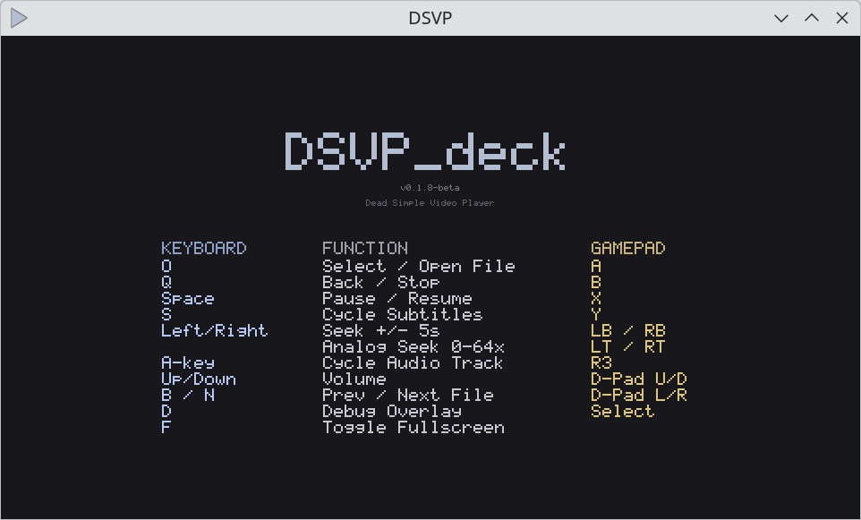
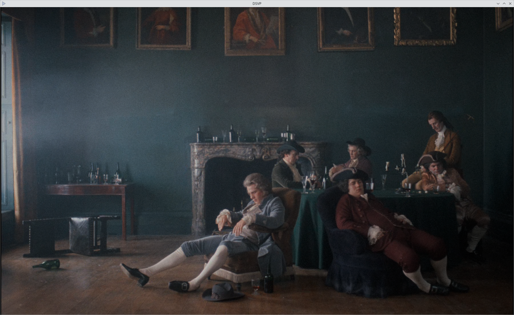

# DSVP — Dead Simple Video Player




WHY? Because I can. And education. And I'm a config-fiddler that wanted to offer a mpv-style player without configs or intimidation factor. Think of DSVP as a middle-man between VLC and mpv. It's not as SOTA as mpv but should be more "user-friendly". 

TODO: bitstream support and HDR autodetect/output. Soon. ish.

There are portable Windows and Linux builds on the Releases page, and Steam Deck builds you can download and try [HERE](https://github.com/ASIXicle/DSVP/releases/tag/v0.2.0-beta-steamdeck). The portable tarballs bundle all dependencies including FFmpeg 8.1 — just extract and run. Windows and Debian installers are also available. The Steam Deck build (see `steamdeck` branch) includes VAAPI hardware decode for HEVC.

REQUIRES Visual C++ Redistributable runtime on Windows (vcruntime140.dll). It's probably already on your PC but you can get it here:
https://learn.microsoft.com/en-us/cpp/windows/latest-supported-vc-redist?view=msvc-170

## Installation

**Windows:** Download `DSVP-0.2.0-beta-setup.exe` from [Releases](https://github.com/ASIXicle/DSVP/releases/) and run it. Installs to Program Files with Start Menu shortcuts and an uninstaller. Alternatively, download the portable `.zip` — extract and run, no installation needed.

**Debian/Ubuntu:** (coming shortly) Download `dsvp_0.2.0-beta_amd64.deb` from [Releases](https://github.com/ASIXicle/DSVP/releases/) and install with `sudo dpkg -i dsvp_0.2.0-beta_amd64.deb`. Bundles all dependencies. Run `dsvp` from a terminal or your application launcher.

**Steam Deck:** See [SteamOS.md](SteamOS.md) for the dedicated Steam Deck build with VAAPI hardware decode.

Claude wrote most of this:

---

   
## Features

- **Reference-quality playback** — Lanczos-2 luma scaling (anti-ringing clamp), Catmull-Rom chroma upsampling (siting-corrected), temporal blue noise dithering, faithful color/gamma/framerate
- **HDR→SDR tone mapping** — BT.2390 EETF with dynamic scene-adaptive peak detection (99.875th percentile histogram, temporal smoothing), adjustable SDR target (203/300/400 nits) and midtone gain
- **Dolby Vision** — Profile 5 decode with per-frame RPU updates and piecewise polynomial reshaping; Profile 8 falls through to standard HDR10 path
- **10-bit passthrough** — YUV420P10LE content uploads as R16_UNORM planar textures with no truncation
- **Software decode only** — no hardware decode, no driver quirks, bit-exact output
- **Supports everything FFmpeg supports** — H.264, HEVC, AV1, VP9, VC-1, MKV, MP4, and hundreds more
- **Multi-threaded decoding** — uses all available CPU cores
- **Full subtitle support** — text (SRT, ASS/SSA), bitmap (PGS, VobSub), CJK fallback fonts, golden yellow with black outline, cycle tracks with `S`
- **Folder navigation** — `B`/`N` keys to jump between media files in the current folder, with clickable prev/next buttons
- **Portable or installed** — Windows installer and Debian `.deb` package, or extract-and-run portable tarballs with all dependencies bundled
- **Secure** — no networking capabilities whatsoever
- **Cross-platform** — Vulkan on Windows/Linux, Metal on macOS

## Controls

| Key | Action |
|---|---|
| `O` | Open file |
| `Q` | Quit / close current file |
| `Space` | Pause / resume |
| `F` / double-click | Toggle fullscreen |
| `S` | Cycle subtitle tracks (off → track 1 → track 2 → off) |
| `A` | Cycle audio tracks |
| `←` / `→` | Seek ±5 seconds |
| `↑` / `↓` | Volume up / down |
| `B` / `N` | Previous / next file in folder |
| `D` | Toggle debug overlay |
| `I` | Toggle media info overlay |
| `H` | Cycle HDR debug views (normal / comparison / PQ bypass / grayscale) |
| `T` | Cycle SDR target nits (203 / 300 / 400) |
| `G` | Cycle midtone gain (1.0 / 1.1 / 1.2 / **1.3** / 1.35 / 1.4 — default bold) |

## Building from Source

### Requirements

- **GCC** (MSYS2 MinGW64 on Windows, gcc on Linux, clang on macOS)
- **FFmpeg 8.0+** shared development libraries
- **SDL3** development libraries
- **SDL3_ttf** development libraries
- **SDL3_shadercross 3.0.0** (bundled — not available via package managers)
- **zlib** (for PGS subtitle decompression)
- **GNU Make**
- **pkg-config**

### Windows (MSYS2 MinGW64 + git-bash)

**1. Install MSYS2** from [msys2.org](https://www.msys2.org/) if you don't have it.

**2. Install dependencies** (from MSYS2 MinGW 64-bit shell):
```bash
pacman -S mingw-w64-x86_64-sdl3 mingw-w64-x86_64-sdl3-ttf mingw-w64-x86_64-pkg-config
```

FFmpeg 8.0+ shared libraries are also needed via MSYS2:
```bash
pacman -S mingw-w64-x86_64-ffmpeg
```

**3. SDL3_shadercross** is bundled in `deps/SDL3_shadercross-3.0.0-windows-mingw-x64/`. No action needed — the Makefile finds it automatically.

**4. Configure git-bash** (add to `~/.bashrc`):
```bash
export PKG_CONFIG_PATH="/c/msys64/mingw64/lib/pkgconfig:$PKG_CONFIG_PATH"
export PATH="/c/msys64/mingw64/bin:$PATH"
```

**5. Build** (from git-bash):
```bash
mingw32-make
```

The binary lands in `build/dsvp.exe` with all required DLLs auto-copied.

**6. Package for distribution:**
```powershell
.\installer\build-installer.ps1
```

**7. Build installer** (optional — requires [NSIS](https://nsis.sourceforge.io/)):
```bash
makensis installer/dsvp.nsi
```
Produces `DSVP-0.2.0-beta-setup.exe` in the repo root.

### Linux (Debian/Ubuntu)

**1. Install system packages:**
```bash
sudo apt install gcc make pkg-config \
    libsdl3-dev libsdl3-ttf-dev \
    zlib1g-dev fonts-dejavu-core fonts-noto-cjk zenity
```

> **FFmpeg 8.0+ required.** Debian/Ubuntu may ship an older version (check with `ffmpeg -version`). If your system FFmpeg is below 8.0, see [SETUP.md](SETUP.md) for instructions on building FFmpeg 8.1 from source into a local prefix. The portable tarball from [Releases](https://github.com/ASIXicle/DSVP/releases/) bundles FFmpeg 8.1 and requires no system FFmpeg.

**2. SDL3_shadercross** is bundled in `shadercross/SDL3_shadercross-3.0.0-linux-x64/`. No action needed — the Makefile finds it automatically.

> **Note:** If you see linker errors about missing `.so` files, the soname symlinks may not have survived cloning (some Git/OS combinations don't preserve symlinks). Recreate them with:
> ```bash
> cd shadercross/SDL3_shadercross-3.0.0-linux-x64/lib
> ln -sf libSDL3_shadercross.so.0.0.0 libSDL3_shadercross.so.0
> ln -sf libSDL3_shadercross.so.0.0.0 libSDL3_shadercross.so
> ln -sf libspirv-cross-c-shared.so.0.64.0 libspirv-cross-c-shared.so.0
> ln -sf libspirv-cross-c-shared.so.0.64.0 libspirv-cross-c-shared.so
> ln -sf libvkd3d.so.1.19.0 libvkd3d.so.1
> ln -sf libvkd3d.so.1.19.0 libvkd3d.so
> ln -sf libvkd3d-shader.so.1.17.0 libvkd3d-shader.so.1
> ln -sf libvkd3d-shader.so.1.17.0 libvkd3d-shader.so
> ```

**3. Build:**
```bash
make
```

Binary: `build/dsvp`

**4. Package for distribution:**
```bash
./package.sh
```

**5. Build .deb installer** (optional):
```bash
./installer/package-deb.sh
```
Produces `dsvp_0.2.0-beta_amd64.deb` in the repo root. Builds, packages, and assembles the `.deb` in one step. Use `--skip-build` to repackage without recompiling.

### macOS (untested as of 3/16/26)

```bash
brew install ffmpeg sdl3 sdl3_ttf pkg-config
```

SDL3_shadercross must be built from source or obtained from CI artifacts. macOS uses the Metal GPU backend via `SDL_SetHint`.

```bash
make
```

## Project Structure

```
DSVP/
  src/
    dsvp.h       ← Central state struct, GPU uniforms, constants, declarations
    main.c       ← SDL init, event loop, frame pacing, hotkey handling
    player.c     ← Demux thread, video decode/display, GPU pipelines, HLSL shaders, seeking, media info
    audio.c      ← Audio decode, resample, SDL3 audio stream, A/V clock, track cycling
    subtitle.c   ← Subtitle detection, decode, SDL3_ttf rendering, CJK fallback fonts
    overlay.c    ← GPU-composited overlays: bitmap font, seek bar, debug/info panels, OSD, subtitles
    log.c        ← Crash-safe unbuffered file logger
  installer/
    dsvp.nsi     ← NSIS installer script (Windows)
    build-installer.ps1 ← One-shot Windows installer builder
    package-deb.sh ← One-shot Debian .deb builder (Linux)
  Makefile       ← Cross-platform build (sources from src/, output in build/)
  package.ps1    ← Windows portable packaging script
  package.sh     ← Linux/macOS packaging script
```

## Technical Details



DSVP uses a custom GPU rendering pipeline built on SDL_GPU with HLSL shaders cross-compiled to SPIR-V via SDL3_shadercross 3.0.0. The fragment shader performs Lanczos-2 resampling on luma (16-tap windowed sinc with anti-ringing clamp at 0.8), Catmull-Rom bicubic interpolation on chroma (16-tap with sub-texel siting correction), limited→full range expansion, BT.601/BT.709/BT.2020 color matrix conversion, and temporal blue noise dithering (64×64 void-and-cluster texture, per-frame offset) — all in a single pass. YUV420P and YUV420P10LE formats bypass `swscale` entirely; raw decoded planes upload directly to GPU textures.

For HDR10 content, the shader applies PQ EOTF, BT.2390 tone mapping with scene-adaptive dynamic peak detection (CPU-side histogram scan with temporal smoothing), BT.2020→BT.709 gamut mapping, and configurable midtone gain. Dolby Vision Profile 5 content goes through a per-frame RPU-driven piecewise polynomial reshape before tone mapping. Profile 8 uses the standard HDR10 path via its backward-compatible base layer.

The GPU backend is Vulkan on Windows and Linux, Metal on macOS (untested). Audio is the master clock with adaptive bias correction (EMA α=0.05) for OS audio pipeline latency. At 1:1 content/display framerate (≥50fps), VSync is the sole pacing source with frame drops and delay correction bypassed.

## Debug Build

```bash
make debug          # Linux/macOS
mingw32-make debug  # Windows
```

Enables GPU validation layers, console output, verbose FFmpeg logging, and debug symbols. A `dsvp.log` file is written to the working directory.

## License

GPL v3 — see [LICENSE](LICENSE).

A commercial license is available for proprietary use — see [COMMERCIAL_LICENSE.md](COMMERCIAL_LICENSE.md).
