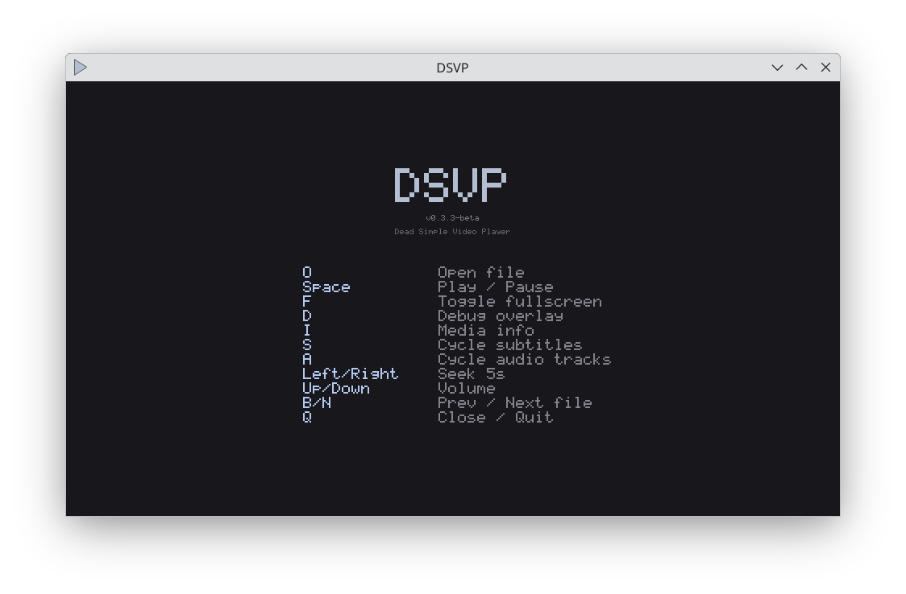
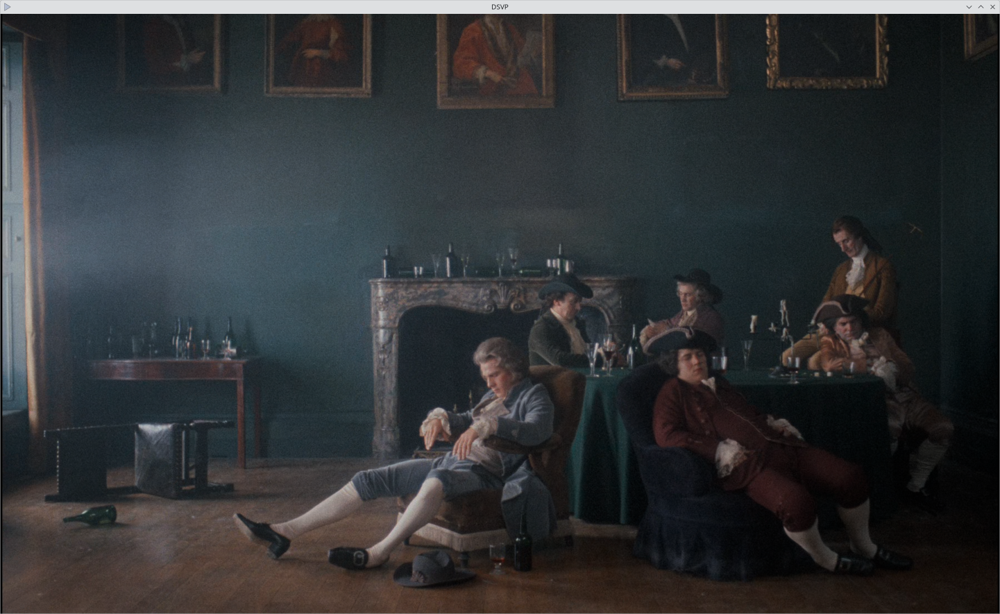

# DSVP — Dead Simple Video Player




WHY? Because I can. And education. And I'm a config-fiddler that wanted to offer a mpv-style player without configs or intimidation factor. Think of DSVP as a middle-man between VLC and mpv. It's not as SOTA as mpv but should be more "user-friendly". 

**HDR SUPPORT IS NOW LIVE — but your mileage may vary. Still beta-state, feedback appreciated.** On an HDR display press `Z` and DSVP switches the display into HDR mode itself, passes the picture through untouched, and puts the display back exactly as it found it when you quit.

**Audio bitstreaming: not yet.** Every audio track is decoded to PCM inside the player (TrueHD, DTS-HD and Atmos play as their lossless or core PCM).

There are portable Windows and Linux builds on the Releases page, and Steam Deck builds you can download and try [HERE](https://github.com/ASIXicle/DSVP-deck). The portable tarballs bundle all dependencies including FFmpeg — just extract and run. Windows and Debian installers are also available.

REQUIRES Visual C++ Redistributable runtime on Windows (vcruntime140.dll). It's probably already on your PC but you can get it here:
https://learn.microsoft.com/en-us/cpp/windows/latest-supported-vc-redist?view=msvc-170

## Installation

**Windows:** Download the `DSVP-<version>-setup.exe` installer from [Releases](https://github.com/ASIXicle/DSVP/releases/) and run it. Installs to Program Files with Start Menu shortcuts and an uninstaller. Alternatively, download the portable `.zip` — extract and run, no installation needed.

**Debian/Ubuntu:** Download the `dsvp_<version>_amd64.deb` package from [Releases](https://github.com/ASIXicle/DSVP/releases/) and install with `sudo dpkg -i <the .deb>` (root is needed for a system-wide install, as with apt; remove with `sudo dpkg -r dsvp`). Bundles all dependencies. Run `dsvp` from a terminal or your application launcher. Prefer no root? The portable tarball extracts and runs from your home directory.

**Steam Deck:** See [SteamOS.md](https://github.com/ASIXicle/DSVP-deck/blob/main/SteamOS.md) for the dedicated Steam Deck build with VAAPI hardware decode.

---

   
## Features

- **Reference-quality playback** — Lanczos-2 luma scaling (anti-ringing clamp, footprint-dilated on downscale), Catmull-Rom chroma upsampling (siting-corrected), temporal blue noise dithering, gamma-2.2 reference output (`DSVP_OUTPUT_GAMMA=srgb|2.2|2.4`)
- **HDR→SDR tone mapping** — BT.2390 EETF with dynamic scene-adaptive peak detection (99.875th percentile histogram, temporal smoothing with scene-cut handling), HLG (BT.2100 OOTF), adjustable SDR target (203/300/400 nits) and midtone gain
- **Dolby Vision** — Profile 5 and Profile 8 decode with per-frame RPU updates; piecewise polynomial luma and MMR cross-channel chroma reshaping driving HDR→SDR tone mapping
- **10-bit passthrough** — YUV420P10LE content uploads as R16_UNORM planar textures with no truncation
- **Software decode only** — no hardware decode, no driver quirks, bit-exact decode
- **Supports everything FFmpeg supports** — H.264, HEVC, AV1, VP9, VC-1, MKV, MP4, and hundreds more; interlaced content deinterlaces automatically (bwdif, engaged only when frames are flagged interlaced — `DSVP_DEINT=0|1` overrides)
- **Multi-threaded decoding** — adaptive thread count per codec (HEVC up to 12, H.264 up to 8, others up to 16), capped to logical CPU count
- **Full subtitle support** — text (SRT, ASS/SSA), bitmap (PGS, VobSub), CJK fallback fonts, golden yellow with black outline, cycle tracks with `S`
- **Folder navigation** — `B`/`N` keys to jump between media files in the current folder, with clickable prev/next buttons
- **Portable or installed** — Windows installer and Debian `.deb` package, or extract-and-run portable tarballs with all dependencies bundled
- **Secure** — no networking, enforced: file opening runs under an FFmpeg protocol whitelist (`file` only), so even URL arguments cannot touch the network
- **Cross-platform** — Vulkan on Windows/Linux (macOS untested)

## Controls

| Key | Action |
|---|---|
| `O` | Open file |
| `Q` | Quit / close current file |
| `Space` | Pause / resume |
| `F` / double-click | Toggle fullscreen |
| `S` | Cycle subtitle tracks (off → track 1 → track 2 → off) |
| `A` | Cycle audio tracks |
| `←` / `→` | Seek ±5 seconds |
| `↑` / `↓` | Volume up / down |
| `B` / `N` | Previous / next file in folder |
| `D` | Toggle debug overlay |
| `I` | Toggle media info overlay |
| `Z` | HDR output: tone-map (SDR) ↔ passthrough (display switches to HDR; needs an HDR display) |
| `PgUp` / `PgDn` | Previous / next chapter (MKV/MP4 chapters; OSD shows the name) |
| `R` | On the idle screen: resume the last file where you left off |
| `Esc` | Cancel the open-file dialog (Linux) |
| `H` | Cycle HDR debug views (normal / comparison / PQ bypass / grayscale) |
| `T` | Cycle SDR target nits (203 / 300 / 400) |
| `G` | Cycle midtone gain (1.0 / 1.1 / 1.2 / **1.3** / 1.35 / 1.4 — default bold) |

## Building from Source

### Requirements

- **GCC** (MSYS2 MinGW64 on Windows, gcc on Linux, clang on macOS)
- **FFmpeg 8.1+** shared development libraries (9.0 recommended — see SETUP.md)
- **SDL3** development libraries
- **SDL3_ttf** development libraries
- **SDL3_shadercross 3.0.0** (bundled — not available via package managers)
- **zlib** (for PGS subtitle decompression)
- **GNU Make**
- **pkg-config**

### Windows (MSYS2 MinGW64 + git-bash)

**1. Install MSYS2** from [msys2.org](https://www.msys2.org/) if you don't have it.

**2. Install dependencies** (from MSYS2 MinGW 64-bit shell):
```bash
pacman -S mingw-w64-x86_64-sdl3 mingw-w64-x86_64-sdl3-ttf mingw-w64-x86_64-pkg-config
```

FFmpeg 8.1+ shared libraries are also needed via MSYS2:
```bash
pacman -S mingw-w64-x86_64-ffmpeg
```

**3. SDL3_shadercross** is bundled in `deps/SDL3_shadercross-3.0.0-windows-mingw-x64/`. No action needed — the Makefile finds it automatically.

**4. Configure git-bash** (add to `~/.bashrc`):
```bash
export PKG_CONFIG_PATH="/c/msys64/mingw64/lib/pkgconfig:$PKG_CONFIG_PATH"
export PATH="/c/msys64/mingw64/bin:$PATH"
```

**5. Build** (from git-bash):
```bash
mingw32-make
```

The binary lands in `build/dsvp.exe` with all required DLLs auto-copied.

**6. Package for distribution:**
```powershell
.\installer\build-installer.ps1
```

This runs `package.ps1` (portable bundle) and then NSIS. `package.ps1` refuses an `unknown`, `+dirty` or debug build stamp and a binary whose build inputs changed since it was linked (`-AllowDirty` for a test bundle); it writes the stamp into the bundle and the NSIS script refuses a bundle without a clean release stamp, so a bare `makensis` can never ship a stale bundle under a new version.

**7. Build installer** (optional — requires [NSIS](https://nsis.sourceforge.io/)):
```bash
makensis installer/dsvp.nsi
```
Produces `DSVP-<version>-setup.exe` in the repo root.

### Linux (Debian/Ubuntu)

**1. Install system packages:**
```bash
sudo apt install gcc make pkg-config \
    libsdl3-dev libsdl3-ttf-dev \
    zlib1g-dev fonts-dejavu-core fonts-noto-cjk zenity
```

> **FFmpeg 8.1+ required** (9.0 recommended). Debian/Ubuntu may ship an older version (check with `ffmpeg -version`). If your system FFmpeg is too old, see [SETUP.md](SETUP.md) for building FFmpeg into a local prefix. The portable tarball from [Releases](https://github.com/ASIXicle/DSVP/releases/) bundles FFmpeg and requires no system FFmpeg.

**2. SDL3_shadercross** is bundled in `shadercross/SDL3_shadercross-3.0.0-linux-x64/`. No action needed — the Makefile finds it automatically.

> **Note:** If you see linker errors about missing `.so` files, the soname symlinks may not have survived cloning (some Git/OS combinations don't preserve symlinks). Recreate them with:
> ```bash
> cd shadercross/SDL3_shadercross-3.0.0-linux-x64/lib
> ln -sf libSDL3_shadercross.so.0.0.0 libSDL3_shadercross.so.0
> ln -sf libSDL3_shadercross.so.0.0.0 libSDL3_shadercross.so
> ln -sf libspirv-cross-c-shared.so.0.64.0 libspirv-cross-c-shared.so.0
> ln -sf libspirv-cross-c-shared.so.0.64.0 libspirv-cross-c-shared.so
> ln -sf libvkd3d.so.1.19.0 libvkd3d.so.1
> ln -sf libvkd3d.so.1.19.0 libvkd3d.so
> ln -sf libvkd3d-shader.so.1.17.0 libvkd3d-shader.so.1
> ln -sf libvkd3d-shader.so.1.17.0 libvkd3d-shader.so
> ```

**3. Build:**
```bash
make
```

Binary: `build/dsvp`

**4. Package for distribution:**
```bash
sudo apt install patchelf   # once — rewrites the shipped binary's RUNPATH
./package.sh
```
`package.sh` refuses to package an `unknown`, `+dirty` or debug build (pass `--allow-dirty` for a test bundle), prints where every bundled library came from, sets each one's RUNPATH to `$ORIGIN` and the binary's to `$ORIGIN/lib:$ORIGIN`, and re-checks the assembled bundle with `LD_LIBRARY_PATH` unset. The X11/DRM/GL/Vulkan/Wayland stack stays on the host by design.

> **Resume:** DSVP remembers the last file you watched and where you were, in a three-line
> `dsvp.resume` next to the executable (or in `%LOCALAPPDATA%\DSVP` / `$XDG_STATE_HOME/dsvp`
> when that directory is not writable). Press **R** on the idle screen to pick up there. That
> file is the only thing DSVP remembers; set `DSVP_NO_RESUME=1` and it is never read or written.

**5. Build .deb installer** (optional):
```bash
./installer/package-deb.sh
```
Produces `dsvp_<version>_amd64.deb` in the repo root. Builds, packages, and assembles the `.deb` in one step. Use `--skip-build` to repackage without recompiling.

### macOS (untested as of 3/16/26)

```bash
brew install ffmpeg sdl3 sdl3_ttf pkg-config
```

SDL3_shadercross must be built from source or obtained from CI artifacts. macOS uses the Metal GPU backend via `SDL_SetHint`.

```bash
make
```

## Project Structure

```
DSVP/
  src/
    dsvp.h       ← Central state struct, GPU uniforms, constants, declarations
    main.c       ← SDL init, event loop, frame pacing, hotkey handling
    player.c     ← Demux thread, video decode/display, GPU pipelines, HLSL shaders, seeking, media info
    audio.c      ← Audio decode, resample, SDL3 audio stream, A/V clock, track cycling
    subtitle.c   ← Subtitle detection, decode, SDL3_ttf rendering, CJK fallback fonts
    bitstream.c  ← HDMI sink EDID probe for audio passthrough (Phase 3 scaffolding)
    overlay.c    ← GPU-composited overlays: bitmap font, seek bar, debug/info panels, OSD, subtitles
    log.c        ← Crash-safe unbuffered file logger
  installer/
    dsvp.nsi     ← NSIS installer script (Windows)
    build-installer.ps1 ← One-shot Windows installer builder
    package-deb.sh ← One-shot Debian .deb builder (Linux)
  Makefile       ← Cross-platform build (sources from src/, output in build/)
  package.ps1    ← Windows portable packaging script
  package.sh     ← Linux/macOS packaging script
```

## Technical Details



DSVP uses a custom GPU rendering pipeline built on SDL_GPU with HLSL shaders cross-compiled to SPIR-V via SDL3_shadercross 3.0.0. The fragment shader performs Lanczos-2 resampling on luma (16-tap windowed sinc with anti-ringing clamp at 0.8), Catmull-Rom bicubic interpolation on chroma (16-tap with sub-texel siting correction), limited→full range expansion, BT.601/BT.709/BT.2020 color matrix conversion, and temporal blue noise dithering (64×64 void-and-cluster texture, per-frame offset) — all in a single pass. YUV420P and YUV420P10LE formats bypass `swscale` entirely; raw decoded planes upload directly to GPU textures.

For HDR10 content, the shader applies PQ EOTF, BT.2390 tone mapping with scene-adaptive dynamic peak detection (CPU-side histogram scan with temporal smoothing), BT.2020→BT.709 gamut mapping, and configurable midtone gain. Dolby Vision Profile 5 content goes through a per-frame RPU-driven piecewise polynomial reshape before tone mapping. Profile 8 uses the standard HDR10 path via its backward-compatible base layer.

When the content is not being tone-mapped — `Z`, or `DSVP_HDR_PASS=1` to make it the default — DSVP owns the display for the duration of the file. It switches the output into HDR mode itself (DisplayConfig on Windows, kscreen-doctor on KDE Plasma/Wayland), presents on an HDR10/ST2084 swapchain with the source's PQ signal and BT.2020 primaries untouched, and re-encodes subtitles and the OSD to a fixed graphics white so they do not ride the video's brightness. Everything it changed — HDR state, wide gamut, the compositor's SDR brightness — is read before it is written and restored when the file closes or the player exits; a crash stamp lets the next launch finish that restore if the process died holding the display. If the display cannot be switched, or the swapchain will not take ST2084, playback falls back to the tone-mapped path rather than handing the compositor a PQ surface it will mangle. `DSVP_NO_SYS_HDR=1` keeps DSVP's hands off the display entirely.

The GPU backend is Vulkan on Windows and Linux, Metal on macOS (untested). Audio is the master clock with adaptive bias correction (EMA α=0.05) for OS audio pipeline latency. At 1:1 content/display framerate (≥50fps), VSync is the sole pacing source with frame drops and delay correction bypassed.

## Debug Build

```bash
make debug          # Linux/macOS
mingw32-make debug  # Windows
```

Enables GPU validation layers, console output, verbose FFmpeg logging, and debug symbols. A `dsvp.log` file is written next to the executable (falling back to the working directory if that location is unwritable).

## AI Disclosure

Built with the assistance of Claude Opus and Fable (Anthropic).

## License

GPL v3 — see [LICENSE](LICENSE).

A commercial license is available for proprietary use — see [COMMERCIAL_LICENSE.md](COMMERCIAL_LICENSE.md).
